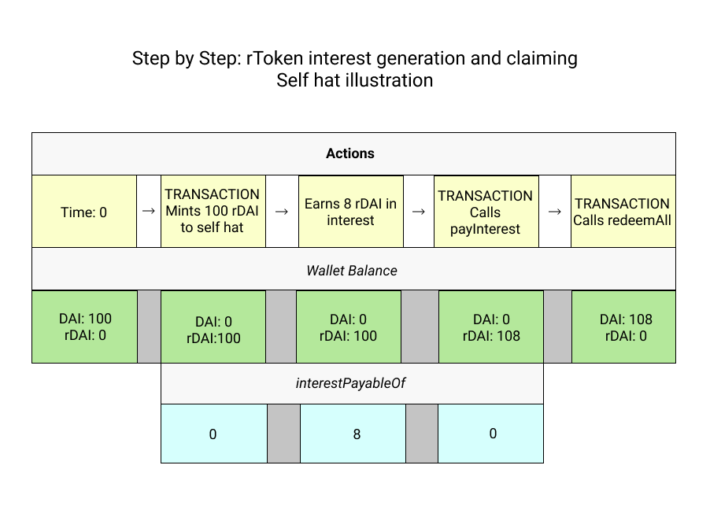
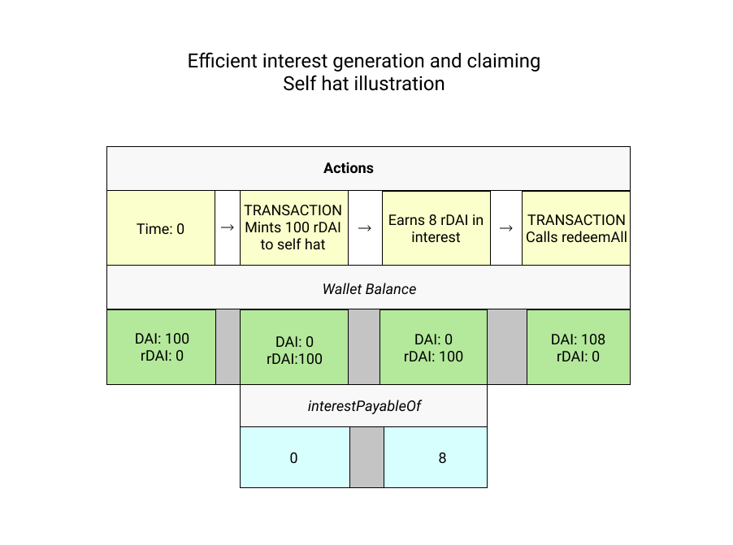

## Interest
---

rTokens do not automatically increment token balances as interest accrues. Token balances in Ethereum can only be updated through transactions. But there is a way to query the amount of accrued interest: `interestPayableOf`. 

##### Querying Accrued Interest
To understand what is happening with interest and how to claim it, there are two values that should be queried for each address: 

1. rToken `balanceOf` - for minters, this will be equal to the amount of the underlying ERC20 asset principal plus the amount claimed through the `payInterest` function, for recipients this value will be 0 until the `payInterest` function is called, which updates `balanceOf`

1. `interestPayableOf` - this is the amount of accrued interest that may be claimed by the address

To illustrate what's going on when, let's look at a simple example where Alice mints 100 rDAI to the self hat (meaning she “redirects” all the interest to herself), accrues 8 rDAI in interest and then claims it.  

The illustration above shows each step, but a more efficient flow would call `redeemAll` after the 8 rDAI have accrued, which calls `payInterest` internally:

##### Claiming Accrued Interest
